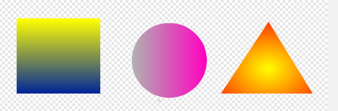
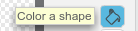
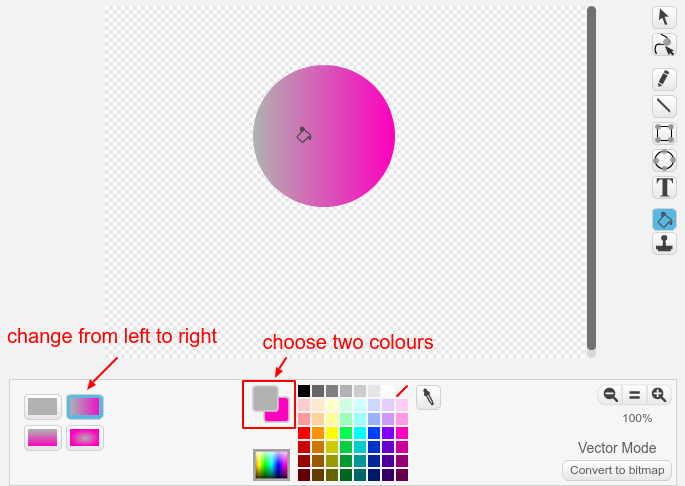

When you are using the Scratch paint tool in vector mode, you can fill a shape with a colour gradient to get interesting shading effects.

First create a shape, then choose the **Color a shape** tool:

Select the kind of gradient you want, and the two colours to which you want to apply the gradient. Then click on the shape you want to fill. 
 

